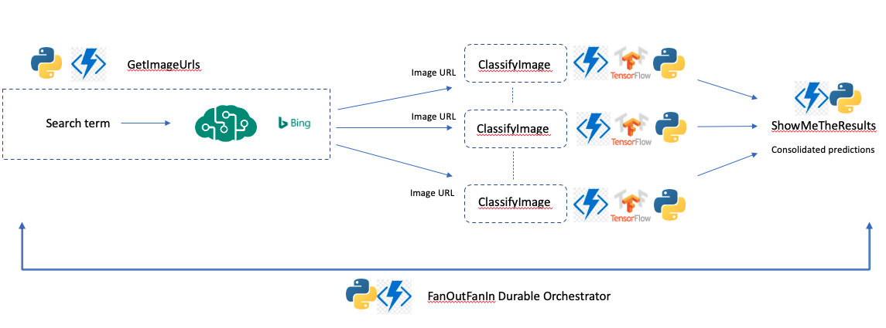

# Fan Out Fan In Image Classification

This sample demonstrates how to orchestrate parallel executions of image classification using tensorflow through the Fan In Fan Out Durable orchestration pattern

 

## Pre-requisites

- Create an [Azure Cognitive Service (Multi service resource)](https://docs.microsoft.com/en-us/azure/cognitive-services/cognitive-services-apis-create-account?tabs=multiservice%2Cwindows) and grab the key and endpoint
- Create a local.settings.json file in this directory
This file stores app settings, connection strings, and other settings used by local development tools. For this sample, you will only need an AzureWebJobsStorage connection string, which you can obtain from the Azure portal.

Your local.settings.json should look like this:

```
{
  "IsEncrypted": false,
  "Values": {
    "FUNCTIONS_WORKER_RUNTIME": "python",
    "AzureWebJobsStorage": "<your connection string>",
    "COGNITIVE_ENDPOINT" : "<your cognitive service endpoint>",
    "COGNITIVE_KEY" : "<your cognitive service key>"
  }
}
```

- Run `pip install -r requirements.txt`


## Run the Sample
To try this sample, run `func host start` in this directory. If all the system requirements have been met, and after some initialization logs, you should see something like the following:

Http Functions:

        DurableTrigger: [POST,GET] http://localhost:7071/api/orchestrators/{functionName}


Send a GET request to http://127.0.0.1:7071/api/orchestrators/FanOutFanIn

And that's it! You should see a JSON response with the status URL's.
